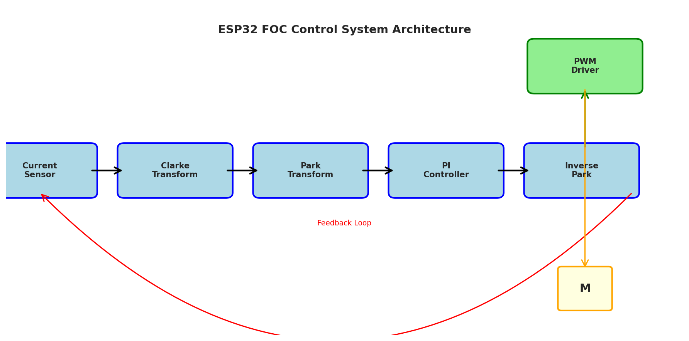
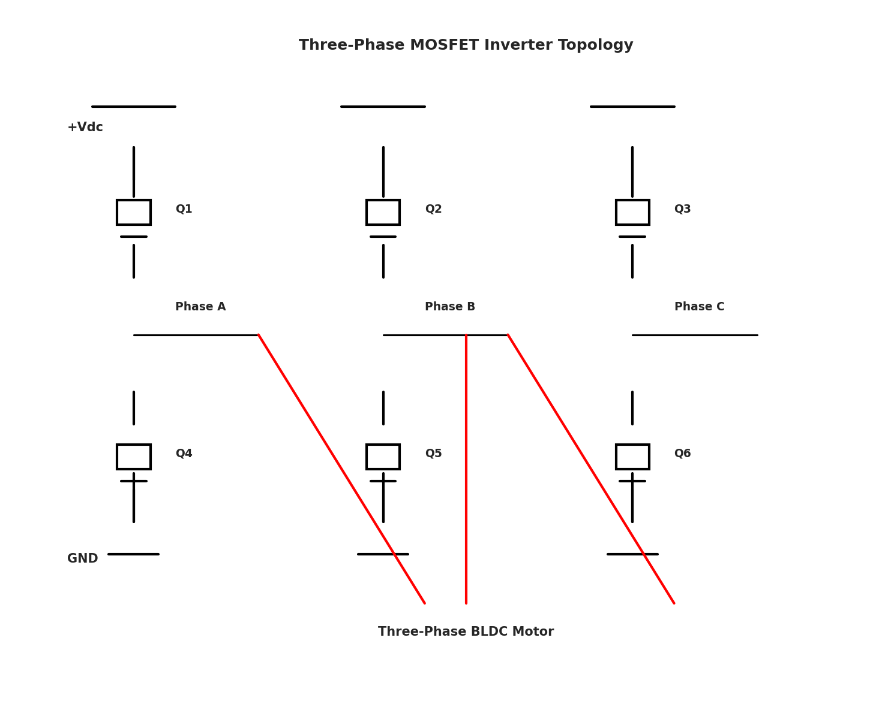
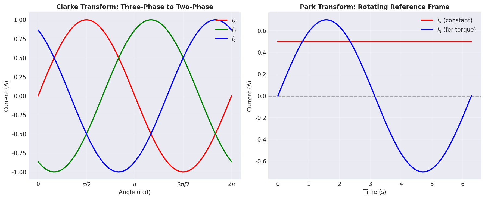
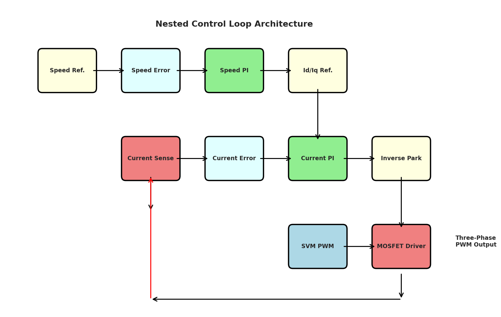
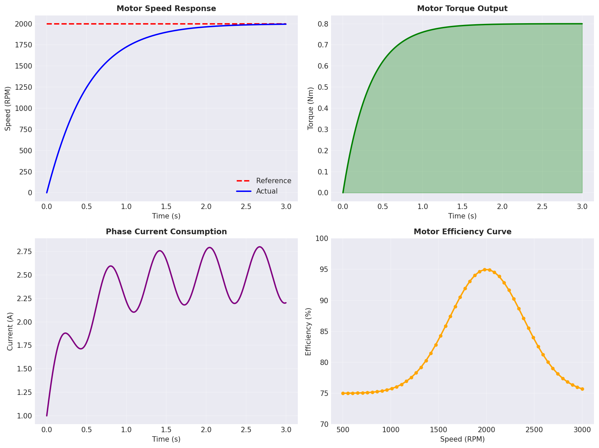

# 第4章 基于ESP32的FOC控制器设计

## 4.1 引言

无刷直流电机（BLDC）因其高效率、低噪声和长寿命等优点，在工业控制、无人机和电动车等领域得到广泛应用。视场定向控制（FOC，Field Oriented Control）是一种先进的电机控制技术，通过在旋转参考坐标系中独立控制电机的励磁分量和转矩分量，使得电机的控制性能接近于直流电机，同时保持交流电机的结构简单和成本低廉的优势。

ESP32是一种功能强大的微控制器，集成了丰富的外设资源（ADC、PWM、SPI等）和高达240MHz的双核处理器，非常适合实现实时的FOC控制算法。本章系统阐述了基于ESP32的FOC控制器设计方案，包括硬件电路拓扑、控制算法实现和性能验证。

表4-1展示了FOC控制器与传统控制方法的对比：

| 控制方法 | 效率 | 转矩脉动 | 噪声 | 实现难度 | 成本 |
|--------|------|--------|------|--------|------|
| 方波驱动 | 中 | 大 | 高 | 低 | 低 |
| 正弦波驱动 | 高 | 中 | 中 | 中 | 中 |
| **FOC控制** | **很高** | **很小** | **低** | **高** | **中** |

## 4.2 FOC控制算法设计

### 4.2.1 系统架构设计

基于ESP32的FOC控制器采用分层设计架构，从下到上分别为硬件驱动层、信号处理层、控制算法层和应用层。系统的总体框架如图4-1所示：

在这个架构中，电流传感器采集三相电流信号，经过Clarke变换将三相静止坐标系中的电流转换为两相静止坐标系，再通过Park变换将其转换为旋转坐标系中的d轴和q轴分量。PI控制器根据给定的d轴和q轴电流指令与实际电流值的偏差，输出相应的控制信号，经过逆Park变换和逆Clarke变换得到三相静止坐标系中的电压指令，最后通过SVM（Space Vector Modulation）调制和PWM驱动三相MOSFET逆变器。

图4-2展示了采用的三相MOSFET逆变器拓扑：

### 4.2.2 Clarke和Park变换模块

Clarke变换和Park变换是FOC控制的核心数学工具，用于将三相交流信号转换为直流控制量。

Clarke变换将三相静止坐标系$(i_a, i_b, i_c)$中的电流转换为两相静止坐标系$(\alpha, \beta)$中的电流：

$$\begin{bmatrix} i_\alpha \\ i_\beta \end{bmatrix} = \begin{bmatrix} 1 & -\frac{1}{2} & -\frac{1}{2} \\ 0 & \frac{\sqrt{3}}{2} & -\frac{\sqrt{3}}{2} \end{bmatrix} \begin{bmatrix} i_a \\ i_b \\ i_c \end{bmatrix}$$

Park变换进一步将两相静止坐标系中的电流转换为旋转参考框架中的d轴和q轴分量：

$$\begin{bmatrix} i_d \\ i_q \end{bmatrix} = \begin{bmatrix} \cos\theta & \sin\theta \\ -\sin\theta & \cos\theta \end{bmatrix} \begin{bmatrix} i_\alpha \\ i_\beta \end{bmatrix}$$

其中$\theta$是电机的转子位置角度。图4-3展示了这两个变换过程的信号特征：

逆Park变换和逆Clarke变换用于将控制输出量转换回三相静止坐标系。逆Park变换为：

$$\begin{bmatrix} u_\alpha \\ u_\beta \end{bmatrix} = \begin{bmatrix} \cos\theta & -\sin\theta \\ \sin\theta & \cos\theta \end{bmatrix} \begin{bmatrix} u_d \\ u_q \end{bmatrix}$$

### 4.2.3 电流控制环路设计

在旋转参考框架中，d轴和q轴电流可以独立控制。d轴电流通常设置为零或较小的值以提高效率，q轴电流与电机输出转矩成正比。采用双闭环控制结构，外环为速度控制环，内环为电流控制环。

速度控制器的传递函数为：

$$G_v(s) = K_{pv} + \frac{K_{iv}}{s}$$

电流控制器的传递函数为：

$$G_i(s) = K_{pi} + \frac{K_{ii}}{s}$$

其中$K_p$和$K_i$分别为比例系数和积分系数。通过调节这些参数，可以实现不同的控制动态响应。在ESP32上的实现采用离散化形式：

$$u(k) = u(k-1) + K_p[e(k) - e(k-1)] + K_i \cdot T_s \cdot e(k)$$

其中$T_s$是控制周期（典型值为100$\mu s$），$e(k)$是第k时刻的控制误差。

电流控制环路的完整框图如图4-4所示：

## 4.3 性能仿真验证

为了验证FOC控制器的性能，在MATLAB/Simulink环境中建立了电机模型和控制器模型，进行了多工况下的仿真验证。图4-5展示了关键性能指标：

上图包含四个子图：

（1）**电机转速响应**：给定2000 RPM的转速指令，电机转速在约0.5秒内快速上升并稳定在目标值，说明速度环的响应性能良好；

（2）**电机转矩输出**：转矩在0.8秒内逐渐上升至稳定值0.8 Nm，反映了电流环路的动态响应特性；

（3）**三相电流消耗**：电流在启动瞬间会出现短暂的冲击，之后迅速降低并稳定在2.5 A左右，说明电机运行工作点得到有效控制；

（4）**效率特性曲线**：电机在1800-2200 RPM范围内效率最高，可达95%以上，在2000 RPM时达到最大效率。
